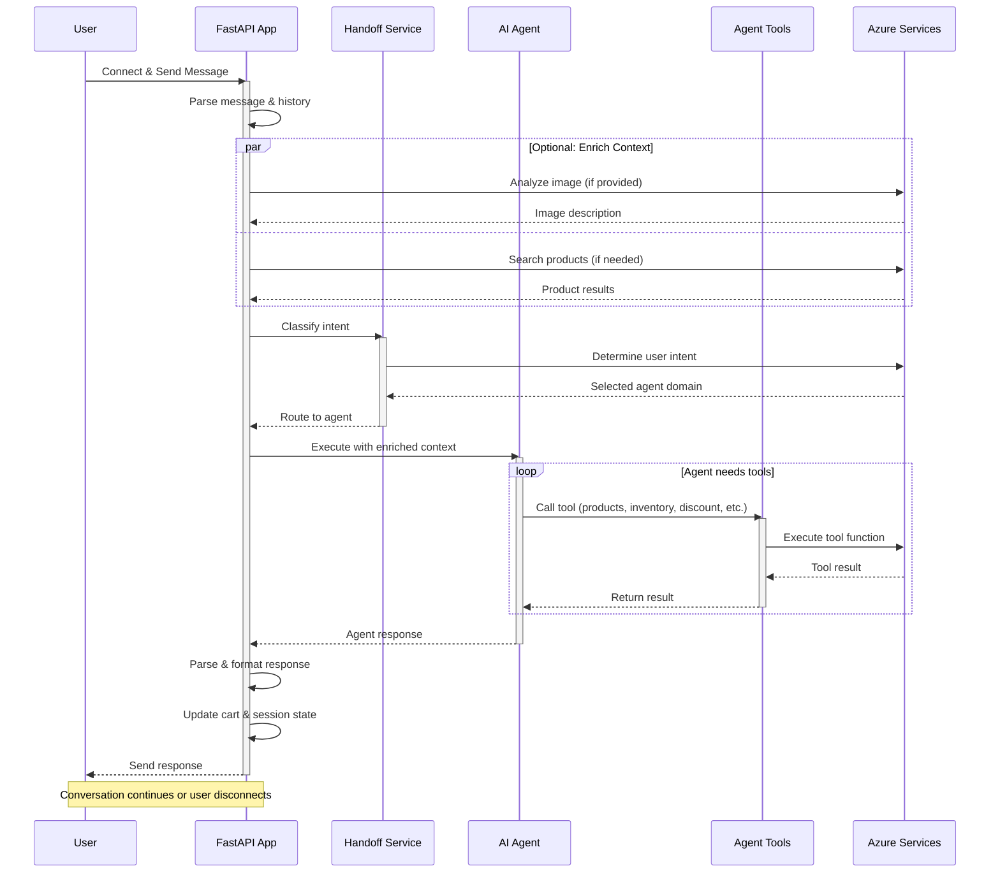

# Application Sequence Diagram

This diagram shows the high-level flow of a user request through the AI Shopping Assistant application.

## Key Components

1. **User Connection**: User sends message via WebSocket to FastAPI
2. **Context Enrichment**: Optional image analysis and product search (executed in parallel)
3. **Intent Classification**: Handoff service determines which agent to route the request to
4. **Agent Execution**: Selected agent processes request with tool calls as needed
5. **Response**: Parse, format, update state, and send back to user

## Flow Details

- **Message Parsing**: Incoming messages are parsed and chat history is maintained
- **Context Enrichment**: If an image is provided, it's analyzed using phi-4 vision. If products are needed, AI Search is queried
- **Handoff Service**: Uses structured outputs to classify user intent and route to the appropriate agent (cora, cart_manager, interior_designer, inventory_agent, or customer_loyalty)
- **Agent Execution**: The selected agent processes the enriched context and may call tools (product recommendations, inventory checks, discount calculations, image generation)
- **State Management**: Cart state and session data are updated before sending the response back to the user
